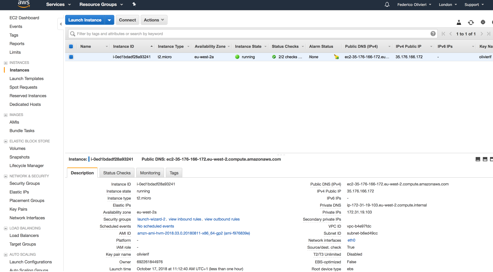
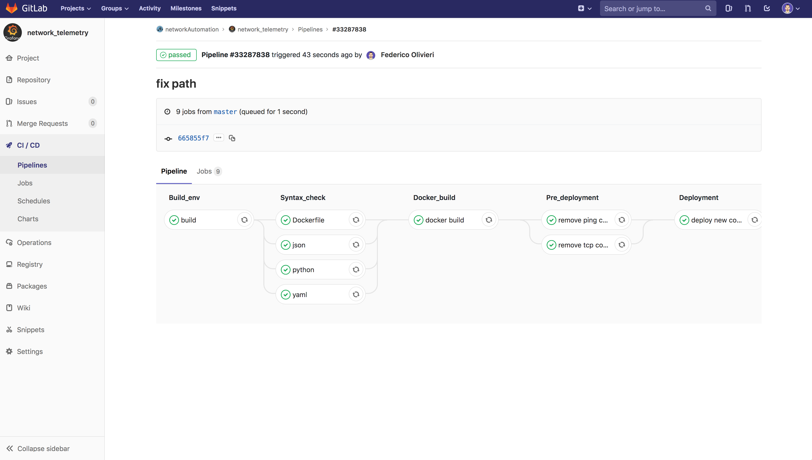
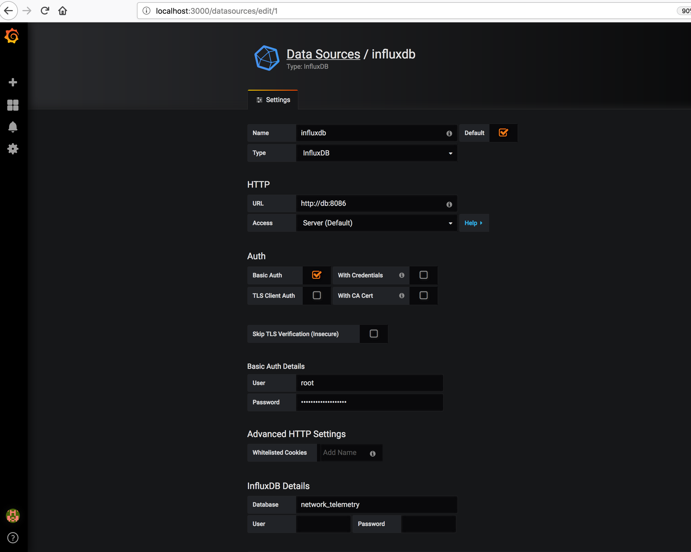
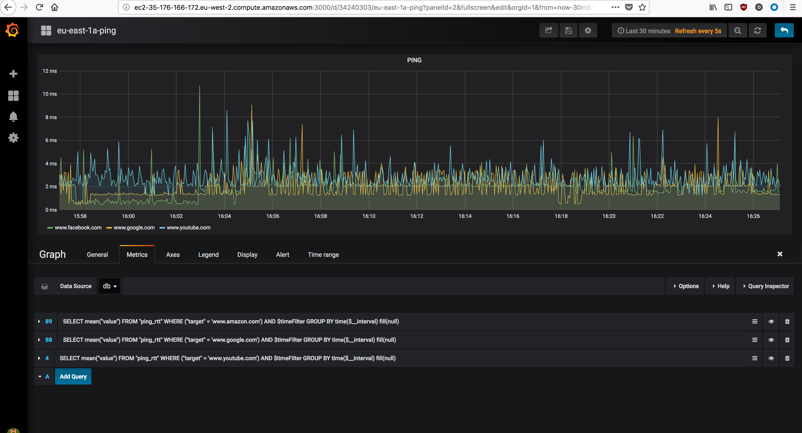
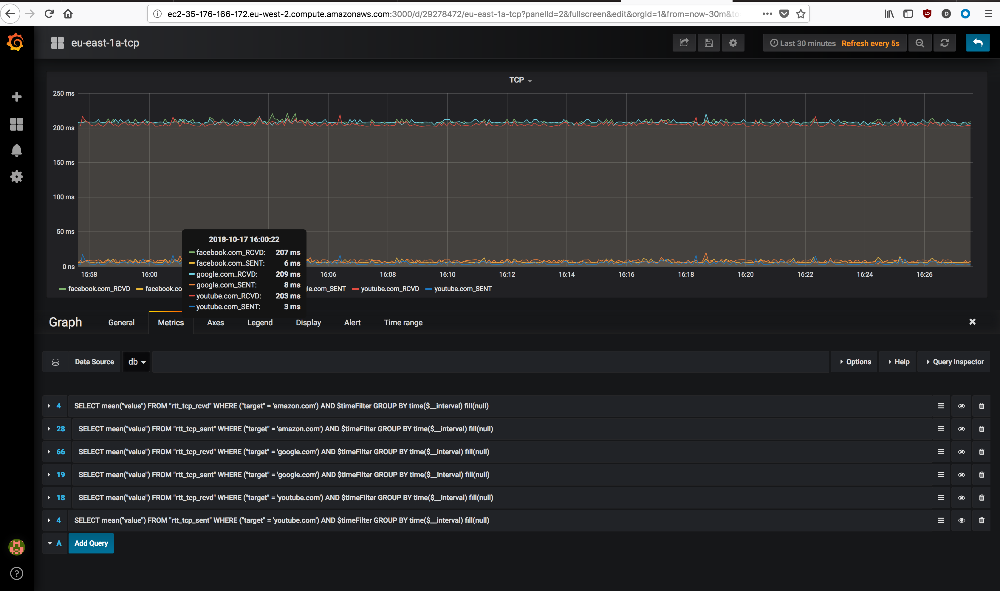

## Network Telemetry

Network telemetry is a tool based on ping RoundTripTime (RTT) and TCP SYN, SYN/ACK RTT. Classic UNIX ping command is used for ping probe, while nping from nmanp package is used for TCP probe.

A piece of python code is executed to run ping and nping command and to extract the RTT from the probes result.

Each probe run against one or multiple target host defined in YAML format under `var/target.yamls`.
The YAML file for ping probes must be in `key:value` format where, `key` is the environment where the prob runs (or whatever meaningful description) and `value` must be a list of all IPs or FQDN intended to be probed.
For TCP probes, the YAML file is still structured in `key:value` format where, `key` is the environment where the prob runs (or whatever meaningful description) and `value` must be one or more (nested) dictionary in `key:value` where the `key` is the IP or FQDN intended to be probed and value and `value` the tcp destination port. Each probe run in its own docker container and has a point-to-point connection with the database container (via virtual link `--link:db` provided on `docker run` command)

Influxdb is used as backend database to store the probes results. The data are fetched via HTTP API call run by each probe. One or more DB can be provisioned for resiliency. In that case, the `db_list` list variable must be updated with the DB hostname or IP, as well as `.credentials.json` with all DBs credentials. Those variables are in `network_telemetry_ping.py` and `network_telemetry_tcp.py`

Influxdb container mounts the database storage under `$PWD/influxdb` and uses a custom config file copied from `$PWD/influxdb/config/influxdb.conf`. Logs for Influxdb are in part disabled and raised to `error` level. That was necessary due to log verbosity that fill the disk space in few days.

Grafana is the more obvious option as frontend web application for the graphing the probes results.
Grafana is listening to 0.0.0.0:3000 and is the only container exposed to the network. As previously said, the other containers are linked each other with `--link` option passed on `docker run`. Few external folders are mapped do Grafana docker. One of these is the plugin folder and if you want install some of plugins you can do it under `$PWDgrafana/database/plugins`. The dashboard settings are also saved on external unit mount under `$PWD/grafana`. Once up and running, Influxdb has to be added as datasource to Grafana.

Dashboards are automagically provisioned based on `target.yaml`, via deployment script or pipeline. You don't need to add manually.

#### Deployment

The probes are available on docker hub via `docker pull federico87/network_telemetry_ping` or
`docker pull federico87/network_telemetry_tcp` so they can be pulled and run with your own custom commands (perhaps you want link the probe container to your own Influxdb instance).

In order to make easier the deployment of the all stack in a local environment, a bash script is provided. Make sure `deployment.sh` is executable using `chmod +x deployment.sh` command. To execute it `/bin/bash deployment.sh`.

A pipeline is provided with `.gitlab-ci.yml` for syntax check and deployment in AWS instance. For this demo the same AWS instance is used for gitlab runner. Is possible to modified the pipeline to deploy the stack in different environment like for example a VM or bare metal server both running docker.

#### Case study

A web front-end developer complains about some connectivity issue between is Django application and Mysql backend database. His web application runs in a CoreOS AWS instance. As always, the developer complains about connectivity issues blaming the network.
Cloning the git repo in his own CoreOS instance, updating the `target.yaml` files with the DB IP and TCP port, running `deployment.sh` script, the developer has a full telemetry setup to verify from up to Layer4 connectivity between the Django instance to DB instance

### AWS instance

### Pipeline

### Grafana add datasource

### Grafana Ping panel

### Grafana TCP panel

