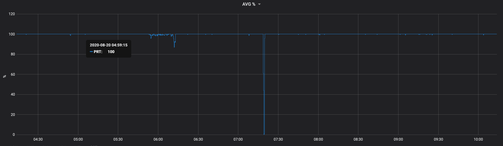
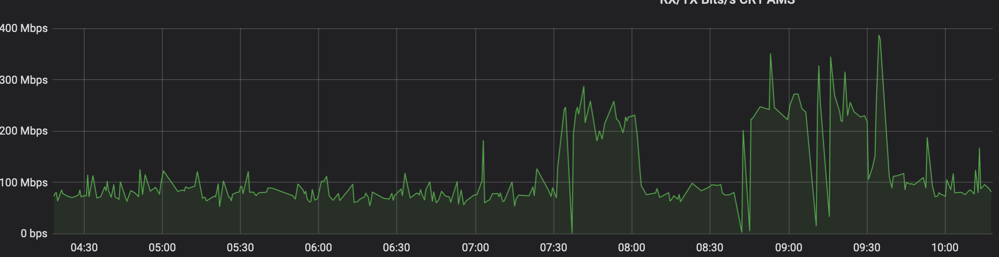
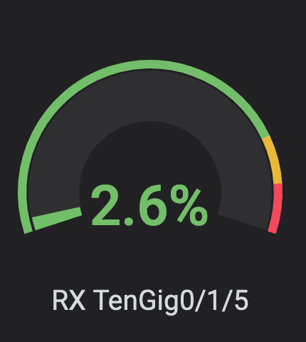

## Network Telemetry

Network telemetry is a tool based on ping RoundTripTime (RTT) and TCP SYN, SYN/ACK RTT. Classic UNIX ping command is used for ping probe, while nping from nmap package is used for TCP probes.

The stack is made of 3 parts: modular python3 code, 1 or ore InfluxDB instance and Grafana.
All members of the stack run in their own Docker container built via pipeline.

#### python3 modules

```
├── Dockerfile

├── classes

│   ├── __init__.py

│   ├── __pycache__

│   ├── influx_body.py

│   ├── ping_alpine.py

│   └── ping_alpine_parser.py

├── network_telemetry_ping_prem_lon.py

└── var

    └── targets.yaml
```

In order to make further implementation easier, the code has been divided in modules (run ping command,  parse ping output, write InfluxDB json API body, threads and API DB call)

`ping_alpine.py` - is the code that actually run the ping command with the flags recognise form Alpine ping command (Alpine is the base OS used to build the container where the probe runs). By default 1 packet is sent with 1 second timeout

`ping_alpine_parser.py` - parse the output passed from ping_alpine.py and extract the values required. These values are:

    Packet transmitted
    Packet received
    Packet loss
    Min response time
    Average response time
    Max response time

`influx_body.py` - builds the actual json body for InfluxDB, with the values passed form the parser.

`network_telemetry_ping.py` - this is the actual code that import the other modules, run the ping commands in multi-thread and make the API call to one or more InfluxDB instance

All the above are also true for TCP probes

Each probe run against one or multiple target hosts defined in YAML format under `var/target.yaml`.
The YAML file for ping probes must be in `key:value` format where, `key` is the environment where the prob runs (or whatever meaningful description) and `value` must be a list of all IPs or FQDN intended to be probed.
For TCP probes, the YAML file is still structured in `key:value` format where, `key` is the environment where the prob runs (or whatever meaningful description) and `value` must be one or more (nested) dictionary in `key:value` format where `key` is the IP or FQDN intended to be probed and  `value` the tcp destination port. Each probe run on in its own docker container and has a point-to-point connection with the database container via virtual network created by docker compose.

Influxdb is used as backend database to store the probes results. The data are fetched via HTTP API call run by each probe. One or more DB can be provisioned for resiliency. In that case, the `db_list` list variable must be updated with the DB hostname or IP, as well as `.credentials.json` with all DBs credentials. Those variables are in `network_telemetry_ping.py` and `network_telemetry_tcp.py`

Influxdb container mounts the database storage under `$PWD/influxdb` and uses a custom config file copied from `$PWD/influxdb/config/influxdb.conf`. Logs for Influxdb are in part disabled and raised to `error` level. That was necessary due to log verbosity that fill the disk space in few days.

Grafana is the more obvious option as frontend web application for graphing the probes results.
Grafana is listening to 0.0.0.0:3000 and is the only container exposed to the external network. Grafana is linked to database via virtual network created by docker compose. Few external folders are mapped do Grafana docker. One of those is the plugin folder and if you want install some plugins you can do it under `$PW/grafana/database/plugins`. The dashboard settings are also saved on external unit mounted under `$PWD/grafana`. Once up and running, Influxdb has to be added as datasource to Grafana.

Dashboards are automagically provisioned based on `target.yaml` and a jinja2 template, via deployment script or pipeline. You don't need to add manually.

#### Deployment

The probes are available on docker hub via `docker pull federico87/network_telemetry_ping` or
`docker pull federico87/network_telemetry_tcp` so they can be pulled and run with your own custom commands (perhaps you want link the probe container to your own Influxdb instance).

In order to make easier the deployment, a docker compose file is provided with all docker arguments passed during docker deployment

A pipeline is provided with `.gitlab-ci.yml` for syntax check and deployment in AWS instance. For this demo the same AWS instance is used for providing gitlab runner. It is possible to modified the pipeline to deploy the stack in different environment like for example a VM or bare metal server.

#### Case study

A web front-end developer complains about some connectivity issue between his Django application and mysql backend database. His web application runs in a CoreOS AWS instance. As always happens in these cases, developer blames the network.
Cloning the git repo in his own CoreOS instance, updating the `target.yaml` files with the DB IP and TCP port, running the pipeline, the developer has a full telemetry setup to verify up to Layer4 connectivity between the Django instance to DB instance. So it will help him if there is a real network connectivity issue (ping), slow application response (TCP) or neither of both.

### AWS instance


### Pipeline


### Grafana add datasource


### Grafana Ping panel


### Grafana TCP panel


### (InfluxDB) queries!

#### % circuit reliability 

`SELECT mean(percentage) FROM (SELECT ("received"/"transmitted")*100 AS percentage FROM "ping_rtt" WHERE "host" = '8.8.8.8' AND $timeFilter) GROUP BY time($__interval) fill(none)`



#### from octets to bits

`SELECT non_negative_derivative(mean("ifInOctets"), 1s)  *8 AS "TenGigE0/1/5" FROM "interface" WHERE ("hostname" = 'my.device.fqdn' AND "ifDescr" = 'TenGigabitEthernet0/1/5') AND $timeFilter GROUP BY time($__interval), "ifDescr" fill(null)`



#### interface bandwtih utilization

`SELECT (non_negative_derivative(last("ifInOctets"), 30s) *8*100)/(30*max("ifSpeed")) FROM "interface" WHERE ("hostname" = 'my.device.fqdn' AND "ifDescr" = 'TenGigabitEthernet0/1/5') AND $timeFilter GROUP BY time($__interval) fill(none)`

NOTE: Watch out for DELTA (`30s`)

Cisco: [link](https://www.cisco.com/c/en/us/support/docs/ip/simple-network-management-protocol-snmp/8141-calculate-bandwidth-snmp.html)

Solarwinds: [link](https://support.solarwinds.com/SuccessCenter/s/article/Calculate-interface-bandwidth-utilization?language=en_US)

