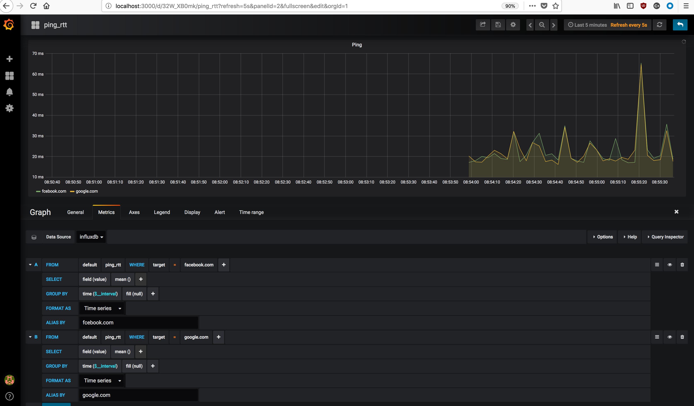
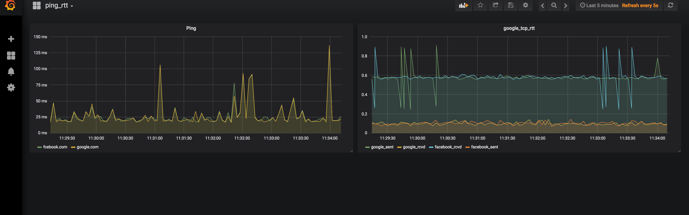

## Network Telemetry

Network telemetry tool based on ping RTT and tcp SYN, SYN/ACK RTT. Python is used to extract the RTT from ping and tcp probes, run against one or more server/application. Influxdb is used as backend database to store the probes results. Grafana is the frontend web application where the graphs are displayed.

Each probe, Influxdb and Grafana run in docker containers linked between each other.

The targets can be updated on `targets.yaml` file following the classic yaml dictionary structure.

Influxdb container will mount the database storage under `$PWD/influxdb` and will use a custom config file copied from `$PWD/influxdb/config/influxdb.conf`. Logs for Influxdb are in part disabled and raised to `error` level. That was necessary due to log verbosity that fill the disk space in few days.

Grafana is listening to 0.0.0.0:3000 and is the only container exposed to the network. The other containers are linked each other with `--link` option passed on `docker run`. If you want install some plugin, you need to log into the container and install from there. The plugins as well as the dashboard settings are saved on external disk mount under `$PWD/grafana`. Once up and running, Influxdb has to be added as datasource to Grafana.

In order to make easier the deployment of the all stack, a bash script is provided. Make sure `deployment.sh` is executable using `chmod +x deployment.sh` command. To execute it `/bin/bash deployment.sh`

### Grafana add datasource

### Grafana Influxdb query

### Grafana ping and tcp dashboard

